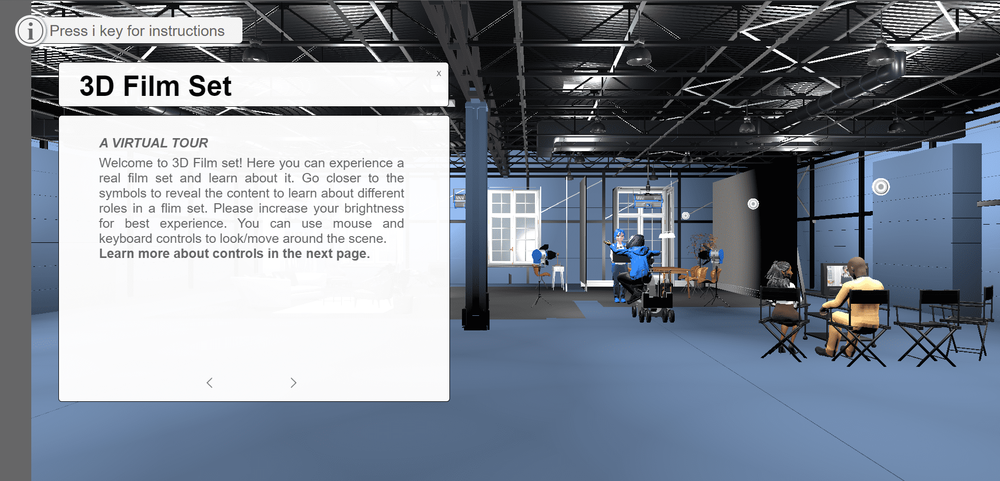
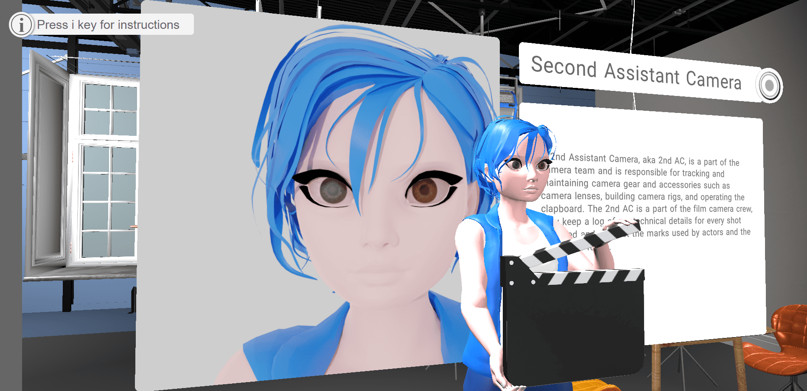

# 3D-film-set

3D Film Set is a website that helps to learn about actual filmset & it's characters by interacting with the website. Users can look and move around the scene to explore different filmset components and learn about specific roles & duties performed by the filmset staff. 3D Film Set was inspired by FPP games to make learning experience more fun and engaging.

Fig 1: Film Set scene page

Fig 2: Film Set popup page

# Tech Stack

HTML, CSS, Bootstrap, JavaScript, Webpack, Blender

# Demo 

Watch demo [here](https://film-tour.web.app/)
